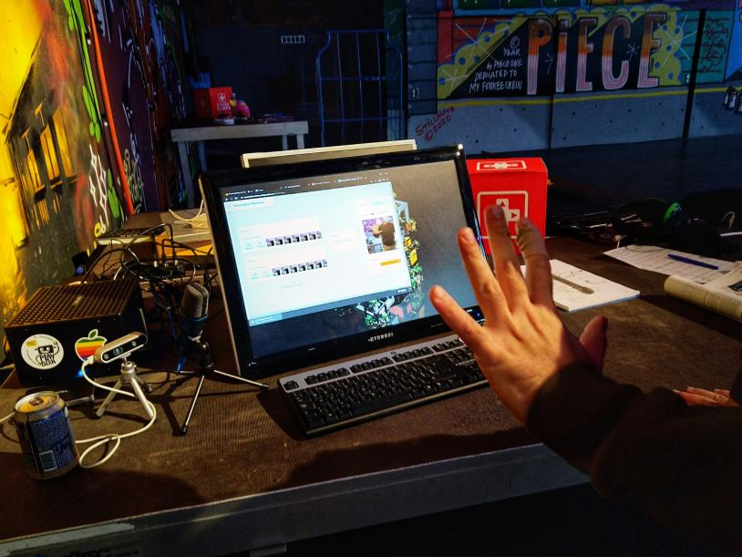
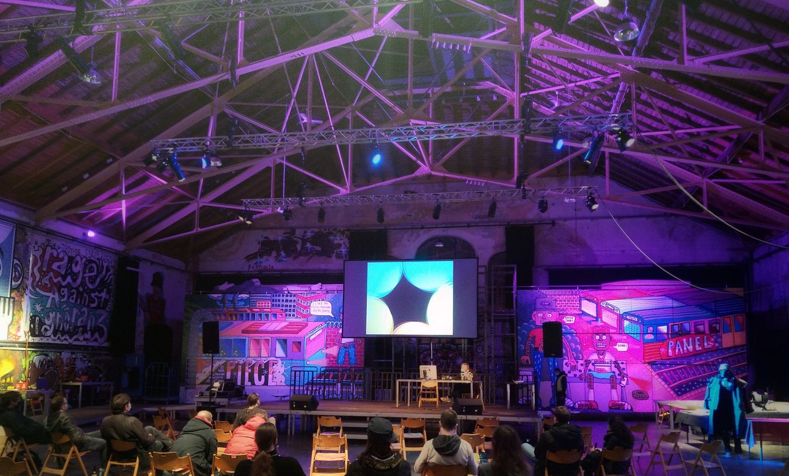

+++
title = "PlayBern"
date = "2020-10-30"
draft = false
pinned = false
tags = ["gamejam", "gamedevelopment", "gamedesign"]
image = "gamejam1.jpeg"
description = "In diesem Blogeintrag geht es um den GameJam am 16.-17.10."
footnotes = ""
+++
Am 16. und 17. Oktober war ich am GameJam zusammen mit Oleg. Es hat mir Riesenspass gemacht einmal bei einem GameJam dabei zu sein. Ich habe sehr viele neue Erfahrungen gesammelt, und ich werde auch sicherlich nächstes Jahr wieder dabei sein. Ich und Oleg haben [dieses Game](https://sxvxgx.itch.io/adventurecraft) programmiert (also hauptsächlich Oleg, weil ich mich nicht so gut mit JavaScript auskenne, nur so die Basics). Ich habe die Charaktere ausgewählt, währenddessen hat Oleg das Game programmiert. Auch habe ich vom Event Fotos gemacht. Das hat mir auch Spass gemacht. Ich hoffe aber, dass das nächste Mal mehr Leute kommen werden, weil wegen Corona sind nicht sehr viele gekommen. Das fand ich schade.

Wie funktioniert das Game?\
Du brauchst eine Webcam als "Controller". Um anzugreifen machst du die Faust und um abzuwehren machst du eine offene Hand.

