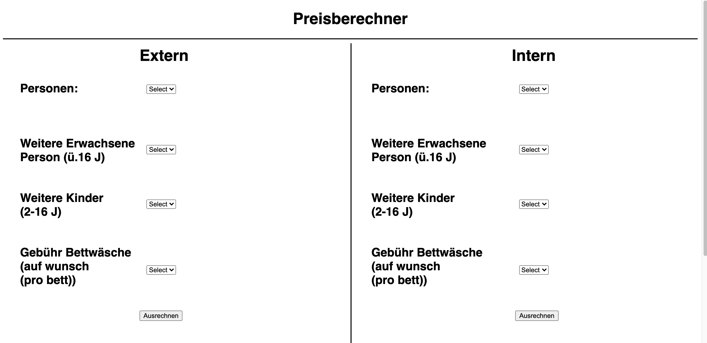
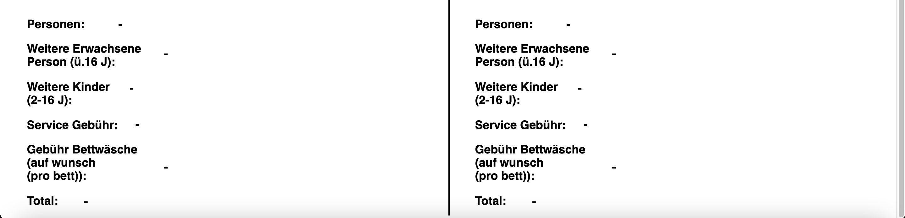

+++
title = "Preisberechner"
date = "2021-04-08"
draft = false
pinned = false
tags = ["preisberechner", "programming"]
image = "imgonline-com-ua-compresstosize-sa5efclryyaw.jpg"
description = "Einen Blog Eintrag über den Preisberechner Job von Fabian."
footnotes = ""
+++
## **Preisberechner**

Fabian hat am 1. Februar gefragt ob jemand Lust hätte, einen Preisberechner zu programmieren. Da ich nichts zu tun hatte im Moment habe ich zugesagt.

Am Anfang haben wir uns getroffen und er hat mir gesagt wie er gerne den Preisberechner haben würde. Dann habe ich angefangen das zu programmieren. Am Anfang gab es eigentlich keine grossen Herausforderungen.

Als erstes habe ich das Html gemacht. Das war auch das Einfachste von allem. Ich habe ein paar [selects](https://www.w3schools.com/tags/tag_select.asp) gemacht und noch Text hinzugefügt. 

Dann habe ich mich ans Css gemacht. Das war eigentlich auch recht einfach, aber ich habe nicht sehr gut nachgedacht während dem Programmieren und darum habe ich alles einzeln positioniert was dazu führt, dass wenn man einen kleineren/grösseren Bildschirm hätte, das dann alles anders aussehen würde.

Danach habe ich das JavaScript programmiert. Das JavaScript (kurz, JS) war das Schwierigste von allem. Als erstes habe ich bei den selects Werte hingetan (wie viel es kosten würde). Dann habe ich lediglich im JS den Wert wo man ausgewählt hat zusammen gerechnet und dann beim Total wiedergegeben.

Nachdem ich das alles programmiert hatte, habe ich es Fabian gezeigt. Er fand es gut, nur das Design hat ihm nicht so gefallen. Ein paar Wochen später hat er mir ein neues Design gegeben (das was jetzt auf der Website ist). Und er wollte auch das wenn man z.B. 2 Erwachsene und 2 Kinder hat, dass ein Kind in den Grundtarif von den beiden Erwachsenen eingerechnet wird (hier als [Erklärung](https://photos.app.goo.gl/pVLXRBuQ4qYLBZJ18)). Das war mit Abstand das Schwierigste von allem. Als erstes habe ich es selber versucht mit [If else](https://www.w3schools.com/js/js_if_else.asp) Funktionen. Doch das hat nicht funktioniert. Da ich beim ICT-Campus bin, habe ich einen vom ICT-Campus angeschrieben und gefragt ob er mir helfen konnte. Er hat mir dann gesagt, dass es noch eine andere Funktion gibt nämlich eine [Switch](https://www.w3schools.com/js/js_switch.asp) Funktion. Zu dem Zeitpunkt wusste ich nicht was das war, doch zum Glück hat er es mir erklärt (ich werde hier nicht erklären wie eine switch Funktion funktioniert). Es hat dann auch funktioniert und ich war sehr froh.

Zurück zum Design. Er hat mir dieses [Design](https://drive.google.com/file/d/10hzRC3NQ6C8QZDp2brd62wdBkoB8oSNX/view?usp=sharing) geschickt, und ich habe es dann auch recht schnell und einfach umgesetzt. Ich habe es aber anders als das Vorherige gemacht und zwar habe ich nicht jedes einzelne Modul/Text positioniert sondern habe ich alles in ein [Div](https://www.w3schools.com/tags/tag_div.ASP) gemacht und dann den Div positioniert. Weil alles was in dem Div ist wird automatisch auch mit positioniert (das nennt man auch [Box-Design](https://www.w3schools.com/css/css_boxmodel.asp)). Dann war ich etwa am 24. März fertig mit dem Preisberechner.

Es hat mir sehr viel Spass gemacht und ich habe auch viel neues gelernt! Falls jemand noch andere Projekte hat für mich, kann er/sie mich entweder auf Slack kontaktieren oder via E-Mail: lyschneider@icloud.com. Hier ist der fertige [Preisberechner](https://c8ps9.csb.app/) und die [Website](https://sevelen.carrd.co/) (bei der Website ein wenig runter scrollen) und der [Code](https://codesandbox.io/s/c8ps9)!

Hier ist noch das alte Design:

