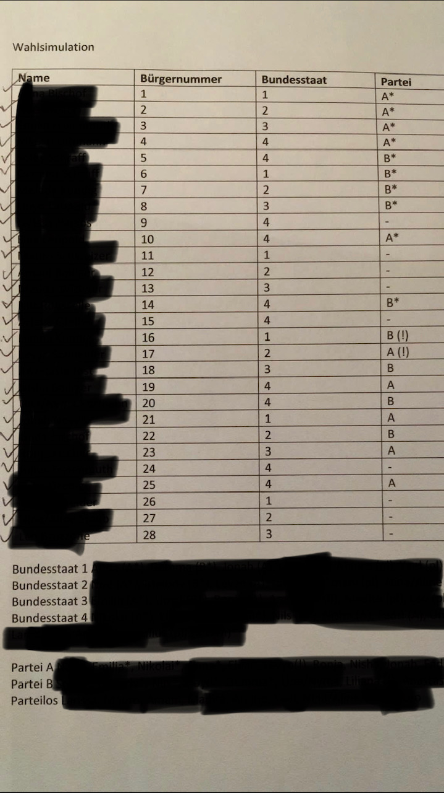
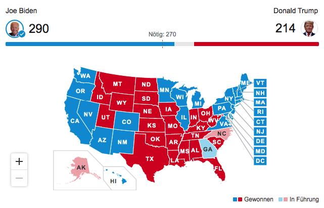

+++
title = "US-Wahlen"
date = "2020-11-09"
draft = false
pinned = false
tags = ["wahlen", "election2020"]
image = "us-wahlen.jpg"
description = "Ein Blog eintrag über die US Wahlsimulation und US Wahlen 2020."
+++
Am 26.10 haben c.a. 30 Homeschooler eine Wahlsimulation gespielt. Als erstes wurden 2 Homeschooler bestimmt die versucht haben die anderen Homeschooler zu überzeugen. Dann gab es Wahlmänner usw. (halt wie eine echte Wahl wie in der USA). Dann wurden die 2 Homeschooler in zwei verschiedene Partei versetzten und haben dann in den 2 Parteien besprochen was ihnen wichtig ist z.B. kein Rassismus. Sobald sie fertig waren wurden alle Homeschooler in 4 Bundesstaaten verschoben (wir haben es nur mit 4 gemacht weil wir nicht so viele Mitglieder hatte für 50 Bundesstaaten). Die 2 Homeschooler sind dann in die 4 Bundesstaaten versetzt rein gegangen und haben den anderen Homeschoolern gesagt was ihnen wichtig ist. Nachdem die 2 Homeschooler in jedem Bundesstaat gewesen sind wurden wieder alle hergehollt (wir haben es über Zoom's Breakoutrooms gemacht). Dann konnten die anderen Homeschooler jeweils die Partei und den Bundesstaaten wählen via Privat Chat an den Host. Dann hat der Host alles zusammen gerechnet und schlussendlich hat sogar meine Partei gewonnen :).\
\
**US-Wahlen**

Ich persönlich finde die US Wahlen sehr kompliziert. Weil in der USA gibt es die normalen Bürger dann gibt es auch noch Wahlmänner und dann hat auch noch jeder Bundesstaat unterschiedlich viele Wahlmänner also ich fände es besser wenn es wie in der Schweiz wäre das der Bundesrat vom Nationalrat gewählt wird und der Bundesrat den/die Präsident/in wählt und das der/die Präsident/in all Jahr wechseln würde. Ich denke dass das Ergebnis sehr knapp werden könnte. Im Moment steht es 253 für Biden und 214 für Trump (Stand 12:21 5.11).\
\
Update: Biden 290 Trump 214 (könnte sich noch ändern) aber schlussendlich hat Biden gewonnen.

