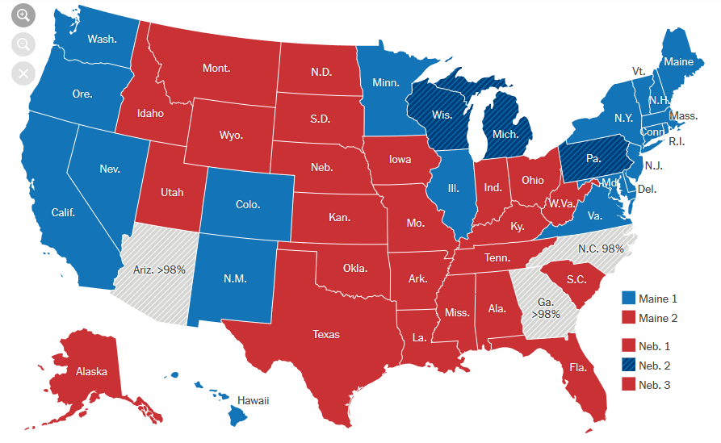

+++
title = "US-Wahlen"
date = "2020-11-12"
draft = false
pinned = false
tags = ["wahlen", "election2020"]
image = "bidenvstrump.jpg"
description = "Ein Blog eintrag über die US Wahlsimulation und US Wahlen 2020."
footnotes = "Das Wahlergebnis ist von der [New york times](https://www.nytimes.com/interactive/2020/11/03/us/elections/results-president.html)"
+++
Am 26.10. haben ca. 30 Homeschooler eine Wahlsimulation gespielt. Als erstes wurden zwei Homeschooler bestimmt, die versuchten die anderen Homeschooler von ihrer Partei zu überzeugen. Dann gab es Wahlmänner usw. (halt wie eine echte Wahl wie in den USA). Danach wurden die zwei Homeschooler in zwei verschiedene Parteien versetzt und besprachen dann in den zwei Parteien, was ihnen wichtig ist, z.B. kein Rassismus. Sobald sie fertig waren wurden alle Homeschooler in vier Bundesstaaten verschoben (wir haben es nur mit vier gemacht weil wir nicht so viele Mitglieder hatten für 50 Bundesstaaten). Die zwei Homeschooler gingen dann in die vier Bundesstaaten versetzt rein und sagten den anderen Homeschoolern, was ihnen wichtig ist. Nachdem die zwei Homeschooler in jedem Bundesstaat gewesen waren, wurden wieder alle hergeholt (wir haben es über Zoom's Breakoutrooms gemacht). Dann konnten die anderen Homeschooler jeweils die Partei wählen via Privat Chat an den Host. Dann rechnete der Host alles zusammen und schlussendlich gewann sogar meine Partei :).

\
**US-Wahlen**

Ich persönlich finde die US Wahlen sehr kompliziert, weil in den USA gibt es die normalen Bürger, dann gibt es auch noch Wahlmänner und dann hat auch noch jeder Bundesstaat unterschiedlich viele Wahlmänner. Also ich fände es besser, wenn es wie in der Schweiz wäre, dass der Bundesrat vom Nationalrat gewählt wird und der Bundesrat den/die Präsident/in wählt und dass der/die Präsident/in jedes Jahr wechseln würde. Ich denke, dass das Ergebnis sehr knapp werden könnte. Im Moment steht es 253 für Biden und 214 für Trump (Stand 12:21 5.11).

Update: Biden 290 Trump 214 (könnte sich noch ändern), aber schlussendlich hat Biden gewonnen.

